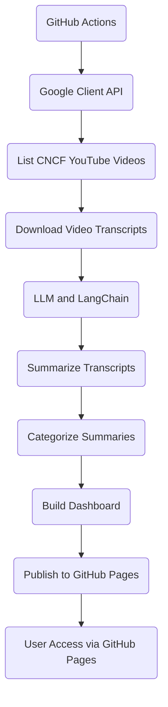

# CNCF Youtube Channel Video Summarizer

## Project Goals
* Use Large Language Model (LLM) to summarize, categorize videos from CNCF YouTube channel.
* Use Cloud Native infrastructure to effectively serve Artificial Intelligence (AI) applications.
# Workflow

1. GitHub Actions are triggered manually or on a schedule.
2. Authentication using Google Client API.
3. Retrieve YouTube videos from CNCF channel.
4. Download transcripts from each video. 
5. Use LLM such as GPT-4 via LangChain to generate keywords and summary of the transcripts.
6. Use LLM to categorize the summaries. 
7. Build a dashboard that use the categorized summaries as navigation of video content.
8. Publish the dashboard and summaries to GitHub Pages using GitHub Actions workflow. 
9. Published contents are accessible via the GitHub Pages URL.

## Functions 
* Search by keywords (speaker/company names, events, projects, technologies, etc). 
* Search by content (Similarity Search) 
* Basic dashboard
